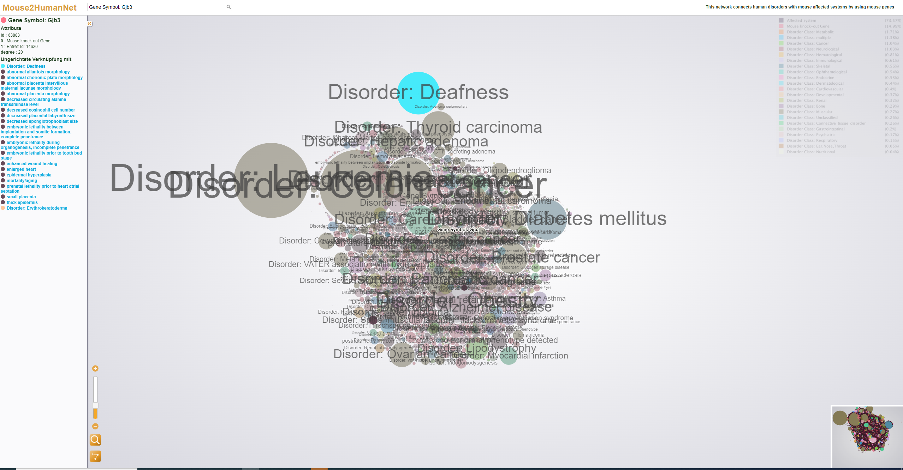

# Mouse Genes Mapping

powered by: https://gephi.org/

The tool maps mause genes with diseases. 
The work was done in colloberation with beloved sis https://github.com/nilaycan

To see: 
```
python3 -m http.server 5000
```

Then go to your localhosts port 5000 in your browser. 




